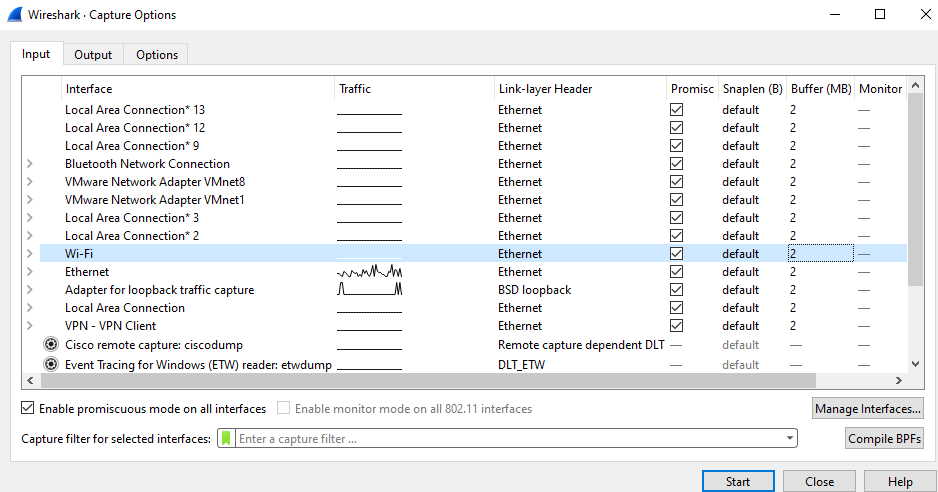

+++
title = "Attempt at Home Network Reconnaissance"
date = 2026-05-03
[taxonomies]
categories = ["Networking"]
tags = ["Recon", "Windows", "SSH", "shiosaiiLabs"]
+++

## Quest for the Wireless NIC
After learning networking in College this year, not only do I want to learn more, I also wanted to use my current skills in a networking project. This is the perfect time to learn Network Reconnaissance!

I have a fairly extensive home network, so this is the perfect environment to investigate and learn networking in greater detail. But to do so, I need some tools and I also need to pray that my hardware is capable of the project 😅😅.

To really achieve this, I want to get my hands on a connection to a wireless nic as my pc only has one ethernet connection and no wireless capabilities. I think I have the perfect candidate; an old gaming pc that my brother lets me use. But this was going to be a mission, because the pc is in a remote part of the house and although ssh is great and all I really wanted to be able to use wireshark graphically... and the gaming pc is running Windows 10 home which doesn't support being a remote desktop server. But I may have an idea...
### Enter "hogwarts"

The shared gaming PC was affectionately known as "the Hog" in reference to the sheer amount of protein folding simulations it would eat through and the volume of medical research it would crap out in it's days of being a folding@home node. But that arc is long since over... now it spends it's days in the much less noble quest of streaming me a somewhat laggy kenshi experience remotely using Sunshine.

If anyone reading wants to put their computer to work, I highly recommend installing the folding@home client so you can simulate protein folding on your own system and send medical research to the University of Pennsylvania. You can do so by downloading the client at this link:
[folding@home start page](https://foldingathome.org/start-folding/)

As for the game streaming, it's a nice setup. I installed Sunshine on the Hog so I can stream games on the desktop on a local web server, and use Moonlight on my main PC "chang-e" to pretty much play the game remotely. And yeah, the irony of using an app called Moonlight on a PC named after the Chinese Goddess of the Moon isn't lost on me. If you think a setup like this would be good for you, check out Sunshine here:
[Sunshine github](https://github.com/lizardbyte/sunshine)

I just installed moonlight on chang-e from the Arch User Repository, so to do that it would just be `yay -S moonlight-qt-bin`

Being able to control a remote PC's desktop using a stream instead of RDP is a nice little workaround for Microsoft prohibiting Remote Desktop Server on Windows 10 home; and this means my remote yet graphical Wireshark dreams become real.

Thus the Hog becomes a tool and space for learning and is now dubbed "hogwarts".

### Installing Wireshark
The install wizard prompted me asking if it should install any external capture tools and because most of these are actually useful to me I'm going to make a table explaining each one so if you're attempting this too, you know which to include in your install.

| Tool Name   | What its for                                        |
| ----------- | --------------------------------------------------- |
| sshdump     | Sending traffic remotely with SSH                   |
| ciscodump   | Analysing a network with Cisco devices              |
| udpdump     | Devices that stream UDP                             |
| androiddump | This is used for android devices via USB            |
| randpkt     | Testing your Wireshark setup without a real network |:
 
 So as you can see, sshdump is really useful for me because theoretically I could stream traffic from hogwarts's wireless NIC to chang-e and manage it all from there with a CLI with the actual graphical wireshark instance as backup if I need it.
### Windows Failed Me

That dream crushing image you see above is confirmation of my worst fears... Although the Intel Dual Band Wireless-AC 3168 is supposed to be capable of monitor mode, as usual Windows doesn't want to let you have fun and is blocking it from entering monitor mode at the driver level trapping my NIC in a cage of mediocrity. How naive I was to attempt a technical project on windows.

### Plans For Next Time
As many readers might be thinking, why don't I just take the NIC out of hogwarts and put it in chang-e where I have a beautiful arch linux system? Well, I tried... I swear that tiny screw in the m.2 socket won't come out for anything, so the NIC is a permanent piece of hogwarts now. Maybe I should be calling it the hog again, because the only thing I learned is to never, ever touch windows if I don't have to.

There is one last hope however... But I need to fix my broken headless debian install on the hog's HDD. For some reason after bootup the hog struggles to draw the graphics of the terminal, which is pretty sad but with some effort I might be able to fix it.

Overall doing recon on your home network is a cool project and I'd reccommend it to everyone reading, especially if you don't have to jump through as many hoops as I do just to set it up.
